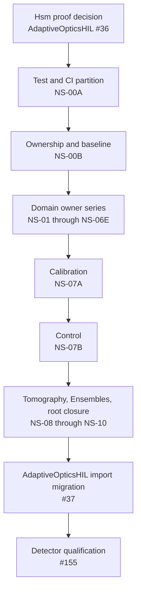

# Roadmap

Status: active

This roadmap is intentionally short. Historical implementation plans were
removed from the live docs tree during the April 2026 documentation cleanup; use
git history if old plan details are needed.

## Current State

AdaptiveOpticsSim.jl is usable for maintained CPU workflows and selected
hardware-validated GPU workflows. The core package now has:

- typed AO model objects for optics, atmosphere, WFS, detectors, DMs, and
  control, plus the HIL-neutral `AdaptiveOpticsSim.Plant` runtime
- CPU tests across Linux, macOS, and Windows
- an active AMDGPU release gate and a retained CUDA hardware target with current
  manual WSL evidence; CUDA remains outside the release gate
- a maintained zero-allocation hot-path focus for CPU HIL-style runtime loops
- explicit coarse ensemble scheduling for independent plants, with optional
  AcceleratedKernels and Dagger integrations kept outside the HIL inner loop
- caller-owned calibration storage plus compact factorized and controller-
  composed reconstruction operators for validated large control surfaces
- measured column-major/native-SIMD CPU kernels for LiFT convolution and LGS
  elongation, without adding an explicit SIMD dependency
- committed reference data and regression tests for core WFS and detector paths
- a completed schedule-free Gate 2 plant boundary with stable path/acquisition
  ownership, per-owner RNGs, fidelity-provider and calibration-illumination
  seams, and a clean serial CPU service-time baseline
- a completed Gate 3 deterministic multi-rate virtual-time engine with one
  canonical plant timeline, bounded trigger fan-out and faults, conventional
  detector lifecycles, fixed prepared storage, and clean scheduler/composed-
  plant CPU evidence
- a completed Gate 4A transport-neutral `AdaptiveOpticsHIL.jl` serial CPU
  vertical slice with injected execution time, canonical command/outcome and
  complete-product ports, bounded lease ownership, a command-responsive fake
  RTC loop, and qualified fixed-arrival evidence
- a completed Gate 8 `AdaptiveOpticsHIL.jl` operational runtime for the
  qualified single-host CPU profile: versioned timing, bounded SPSC ownership,
  long-lived Agent execution owners, typed lifecycle and overload policies,
  coordinated failure/drain/recovery, and clean fixed-arrival, stress,
  allocation/GC, and 300 s soak evidence
- completed Gate 6 prepared CPU path-execution groups with single-writer
  ownership, explicit Julia/FFT/BLAS budgets, a deterministic serial oracle,
  bounded whole-plant specialization, and a separately validated
  `AdaptiveOpticsHIL.jl` pin to the final breaking core revision
- completed Gate 7 single-device direction and optical batching with explicit
  compute-device identity, one prepared accelerator owner, retained
  CPU/AMDGPU/CUDA correctness and service-cost evidence, and a separately
  validated `AdaptiveOpticsHIL.jl` pin
- a canonical `AdaptiveOpticsSim.Plant` owner for HIL-neutral plant time,
  topology, commands, acquisition events, providers, preparation, and event
  composition, with a bounded root export surface and explicit Julia 1.12 API
  tiers
- a compact docs set with one extension guide instead of subsystem plan sprawl

## Near-Term Priorities

`AdaptiveOpticsSim.jl` is being developed as the high-fidelity AO plant for
external-RTC HIL development, following the maintained specifications indexed
by [`hil-package-boundary.md`](hil-package-boundary.md) and tracking completion
in [`hil/compliance-matrix.md`](hil/compliance-matrix.md).

1. Preserve the completed HIL prerequisite Gates 0 and 1 and the qualified
   Gate 4A companion boundary while extending the general HIL runtime. Gate 0
   separates telescope aperture/geometry
   from caller-owned optical
   planes and propagation workspaces; separate shared atmosphere evolution from
   path-local NGS/LGS/source rendering; remove temporal cadence from the
   telescope; define plane geometry/radiometry and safe spectral combination;
   and separate direct-science photon-arrival-rate formation from detector-owned
   temporal integration and acquisition. Then decompose every maintained
   WFS into a prepared optical front end, detector acquisition, and estimator.
   Shack-Hartmann now has an independent microlens array; Pyramid/BioEdge have
   separate physical optics over shared modulation; Zernike/Curvature now
   separate propagation, acquisition, and estimation, including independent or
   packed Curvature detector planes; and LiFT now consumes independently
   acquired, explicitly normalized observations through a separately prepared
   focal-plane model. Cross-backend correctness and residency evidence is now
   complete on the maintained CPU, CUDA, and AMDGPU targets, with clean CPU and
   CUDA service-time artifacts retained. The final Gate 0 ownership review
   removes telescope-owned mutable optical-path state: each maintained WFS,
   science, calibration, atmosphere, and controllable-optic path now consumes
   an explicit `PupilFunction` or field product. Preserve CPU, CUDA, and AMDGPU
   correctness, residency, allocation, and latency evidence throughout the HIL
   migration. Gate 1 froze the breaking plant-oriented API, package/type
   boundaries, atmosphere token/materialization lifetime, deterministic RNG
   ownership, detector event semantics, clock sequencing, and command boundary
   before companion implementation began.
2. Preserve the completed Gate 2 schedule-free plant boundary. It composes
   immutable shared atmosphere/telescope/path definitions, prepared branch-
   local executors, independent acquisition owners, stable per-owner RNGs, and
   full-optical/reduced-order/synthetic provider semantics. Native and
   user-defined calibration illumination enter through typed products without
   instrument-topology assumptions. The clean
   [serial plant artifact](../benchmarks/results/gate2/2026-07-21-serial-plant.toml)
   covers science, NGS Shack-Hartmann, and LGS pyramid directions plus detector
   fan-out with zero warmed allocation; it is a self-paced CPU service-time
   baseline, not an external-RTC latency or fixed-rate capacity claim.
3. Preserve the completed deterministic multi-rate integer-time engine with
   explicit equal-time trigger-distribution, exposure/row-band, optical-sample, nondestructive-read,
   detector-readout, and publication semantics before adding command timing or
   wall-clock pacing. Canonical time, the fixed-capacity event calendar, trigger
   distribution, exact global/rolling/frame-transfer lifecycles, evolving-charge
   HgCdTe ramp reads, and their common serial scheduler composition are
   implemented and validated. The clean [scheduler](../benchmarks/results/gate3/2026-07-21-event-scheduler-gate3-closure.toml)
   and [composed multi-rate plant](../benchmarks/results/gate3/2026-07-21-multi-rate-plant.toml)
   artifacts close the gate without claiming wall-clock pacing, external-RTC
   latency, or production instrument capacity. Keep physical trigger faults
   separate from timestamp-label faults and execution lateness.
4. The individually owned controllable-optic and command-endpoint
   model with prepared core plant command schemas, bounded
   timing and replayable plant-time command-silence semantics, sampled device-
   feedback acquisitions, and prepared plane groups as a deliberate breaking
   change is complete. Gate 4 records stable physical-optic and
   independently latched endpoint identities, immutable versioned semantic
   payload schemas, a bounded endpoint owner with copied payload
   slots, sequence history, future-time admission, application-ready claims,
   terminal dispositions, transactional absolute/incremental effective-command
   state, and replayable hold/safe/fail silence semantics. Plant preparation
   now binds every declared endpoint to an independently timed physical optic;
   the serial event loop composes right-continuous command application,
   half-open detector exposure, additive co-conjugated surfaces, and explicit
   all-or-none multi-optic transactions. Named controller products now bind
   zero-copy to exact prepared endpoints, and the superseded packed
   single-optic runtime has been removed without compatibility adapters. A
   deterministic linear reduced-order direct-measurement model now validates
   command-responsive scheduled execution, matched loop closure, and expected
   degradation inside its declared envelope. Sampled device feedback and a
   trigger-relative autonomous circular-Pyramid model now add bounded
   setpoints, free-running/source/delivered-reset phase relationships, and
   allocation-free cycle-averaged optical regeneration without point-wise RTC
   commands. The clean [command-responsive plant artifact](../benchmarks/results/gate4/2026-07-24-command-plant.toml)
   closes the serial CPU service-cost, terminal-accounting, storage, and
   allocation evidence; current-revision `421/421` CUDA and `431/431` AMDGPU
   targets close the maintained device-resident routing and modulation
   surfaces with scalar indexing disabled. Explicit conjugate placement and
   path visibility begin in Gate 5 rather than being retrofitted into this
   closed gate.
   Operational execution-clock ingress liveness belongs to the later HIL
   lifecycle boundary.
5. Preserve the completed minimal serial CPU HIL vertical slice: one scheduled
   acquisition, one command-responsive optic, an injected `Clocks.jl` clock,
   HIL submission descriptors mapped into core plant commands, canonical
   complete-product and command/outcome ports, bounded SPSC/lease ownership, a
   deterministic fake RTC, and fixed-arrival evidence. The qualified boundary
   remains the serial oracle while worker, GPU, transport-specific, and
   placement-planner capabilities advance through their own gates.
6. Preserve the completed Gate 5 placement/visibility, sampled-coupling, and
   native-DM composition foundation. Every optic and sampled aberration
   declares placement and path visibility; preparation derives bounded
   canonical per-path bindings and compatible couplings; analytic NGS/LGS
   source-footprint geometry composes explicit pupil-relay registration with
   metric plane metadata; common multi-altitude MCAO plus target-local MOAO
   paths retain independent command state; and run-owned native `NCPA` or
   `OPDMap` effects remain isolated to their declared branches. The clean
   [Gate 5 artifact](../benchmarks/results/gate5/2026-07-25-optical-placement.toml)
   closes numerical, declaration-order, finite-support, fixed-storage, and
   bounded-allocation evidence. Preserve the completed Gate 6 path-execution
   groups, CPU ownership budgets, deterministic serial fallback, and
   topology-size-invariant whole-plant registries. The clean
   [Gate 6 grouped CPU artifact](../benchmarks/results/gate6/2026-07-25-grouped-cpu.toml)
   records exact serial/grouped replay, direct-call allocation bounds, first
   use, GC, and paired self-paced service cost without claiming a general
   speedup or fixed-arrival latency. The clean
   [Gate 6 topology-growth artifact](../benchmarks/results/gate6/2026-07-25-topology-growth.toml)
   bounds fresh preparation, first use, storage, method instances, native-code
   size, inference, and warmed allocation over synthetic 4/8/16-path shapes
   without making an NFIRAOS/MORFEO capacity claim.
   [AdaptiveOpticsHIL PR #15](https://github.com/DarrylGamroth/AdaptiveOpticsHIL.jl/pull/15)
   pins both companion environments to core revision `0a38576` and passes the
   cross-platform package, ownership-stress, coverage, and benchmark-contract
   matrix at companion revision `9574432`. Gate 7 separated
   semantic backend family from concrete compute-device identity and exposed
   each prepared path group's immutable backend/device requirements. Finite
   and infinite multilayer atmospheres now provide homogeneous
   single-device direction batching with an exact serial CPU oracle,
   device-resident geometry/output, whole-batch preflight, and explicit
   completion. Compatible physical native-Fraunhofer science directions and
   spectral samples now also have a fixed prepared stack, one optical-axis FFT
   plan, ordered per-sample focal products, exact-device validation, and
   independent detector fan-out. Compatible co-resident equal-rate
   direct-science paths are now bound to one run-immutable accelerator owner
   that retains its exact device context, atmosphere/direct-imaging batches,
   original path-product handoffs, and completion barrier while preserving the
   Gate 6 claim lifecycle. Gate 7.5 extends that exact owner/context and shared
   atmosphere-direction boundary to compatible maintained Shack-Hartmann,
   Pyramid, and BioEdge paths without replacing their domain pipelines, and
   validates a six-row conventional CCD/EMCCD/CMOS/HgCdTe response/readout
   matrix on CUDA and AMDGPU. Gate 7.6 adds a clean-tree paired service-cost
   contract for two compatible off-axis NGS diffractive Shack-Hartmann paths.
   The retained CPU, gfx1030 AMDGPU, and WSL RTX 3050 Ti CUDA artifacts record
   first use, raw HdrHistograms, allocation, exact device residency,
   independent/device-owner parity, and distinct device-ready, host-ready, and
   transfer-only boundaries. Both accelerators pass the predeclared `1.5`
   batched-to-independent median-p95 ceiling while reducing the prepared
   atmosphere-render proxy from two calls to one. This closes the declared
   single-device Gate 7 evidence envelope. Fixed-arrival evidence remains
   required before any HIL latency promotion; mixed placement and multi-GPU
   execution remain Gates 9A and 9B.
7. Harden the transport-neutral HIL companion with lifecycle transitions,
   guaranteed lease-return credit, first-failure propagation, replay classes,
   and GC/process-isolation policy. Add explicit or constrained deterministic
   mixed CPU/GPU placement, then homogeneous multi-GPU placement. Defer a fully
   automatic cost-model planner until real profiles provide calibration data;
   keep Dagger and dynamic migration outside the HIL deadline path. Gate 8
   delivery is tracked by
   [AdaptiveOpticsHIL issue #17](https://github.com/DarrylGamroth/AdaptiveOpticsHIL.jl/issues/17).
   Gate 8.1 qualifies the bounded SPSC layout and publication contract on
   Linux, Windows, and Apple Silicon. Gate 8.2 adds typed canonical-port
   lifecycle, resource-specific full policy, exact ownership-deficit
   accounting, and reserved lease-return credit on the same targets. Gate 8.3
   adds exact prospective external timestamp-domain mappings and hardens
   cached execution-clock ownership and staleness evidence, closing
   `HIL-TIME-002` without claiming transport synchronization. Gate 8.4 adds
   the exact configured/prepared/arming/armed/running/stopped/failed phase
   matrix, same-session readiness and bounded arm windows, immutable active
   serial topology, and distinct typed clean-stop and failure records. This
   advances `HIL-LIFE-001` only to partial: runtime-control semantics,
   coordinated first-failure publication, and bounded failure drain remain
   open at that boundary. Gate 8.5 instantiates stable long-lived owners for
   prepared path
   groups and compatible Gate 7 device batches, with bounded owner-specific
   due/completion rings, deterministic and threaded execution policies, CPU
   budget validation, and nominal lifecycle/accounting integration. This
   advances the lifecycle and complete-resource semantics without claiming
   overload, recovery, affinity, mixed placement, or operational soak
   evidence. Gate 8.6 adds the selected per-command-endpoint execution-clock
   ingress watchdog and mandatory acquisition and execution-owner overload
   policies, promoting `HIL-LIFE-002` and advancing `HIL-PORT-002` and
   `HIL-FAIL-001` without claiming a multi-endpoint atomic latch group.
   Gate 8.7 removes the empty-only parallel control placeholder, establishes
   typed plant command endpoints as the sole model-supported runtime-control
   seam, validates terminal rejection when the bounded future-effective
   command calendar is full, and explicitly selects zero optional observation
   taps for the initial profile. Gate 8.8 is complete in
   [AdaptiveOpticsHIL PR #34](https://github.com/DarrylGamroth/AdaptiveOpticsHIL.jl/pull/34)
   at merge
   [`d77b8c8`](https://github.com/DarrylGamroth/AdaptiveOpticsHIL.jl/commit/d77b8c87627a816b86a18b457a19ead60980a8f9):
   it adds preallocated per-owner failure publication and acknowledgement,
   stable first-observed failure selection, inclusive execution-clock
   acknowledgement/drain deadlines, ordered ingress closure and correlated
   command outcomes, explicit ownership deficits, and fresh-run fail-stop
   recovery. It uses the core optical-batch abandonment prerequisite from
   [PR #132](https://github.com/DarrylGamroth/AdaptiveOpticsSim.jl/pull/132)
   at
   [`68ef433`](https://github.com/DarrylGamroth/AdaptiveOpticsSim.jl/commit/68ef4336e4b87cddc4e5b55acfa97c601a9c6421).
   Gate 8.9 is complete in
   [AdaptiveOpticsHIL PR #35](https://github.com/DarrylGamroth/AdaptiveOpticsHIL.jl/pull/35).
   Its immutable
   [qualification artifact](https://github.com/DarrylGamroth/AdaptiveOpticsHIL.jl/blob/6f10d7fd6d5c7f2891c10ea9100c174c1886154a/benchmarks/results/gate8/2026-07-28-operational-runtime.toml)
   closes the selected single-host CPU envelope with exact replay, independent
   fixed-arrival target and stress runs, burst/shedding, explicit overload and
   fresh recovery, injected failure and named-deficit evidence, bounded warmed
   allocation/GC, and a 300 s soak. The claim is limited to one Linux process,
   in-memory canonical ports, a reduced-order `Float64` plant, two Agent
   execution owners, four physical-core-pinned Julia threads, and
   `SCHED_FIFO` priority 20; transport/RTC interoperability, mixed or GPU
   placement, multi-process/host operation, full optics/detectors, and
   NFIRAOS/MORFEO capacity remain outside it.
8. Complete a bounded `Hsm.jl` proof-of-fit in `AdaptiveOpticsHIL.jl` before
   beginning another breaking core series. The proof may replace only the
   lifecycle control plane, not Agent execution ownership or the SPSC data
   plane, and must record an adopt-or-reject decision against the existing
   state semantics, failure/drain behavior, type stability, warmed allocation,
   and latency evidence.
9. Execute the API namespace refactor described below after that decision and
   before detector qualification. This is a breaking ownership cleanup with no
   compatibility aliases. It must preserve numerical results, accelerator
   extension behavior, prepared ownership, and warmed hot-path budgets.
10. Close the detector-qualification series with a family-specific evidence
    catalog and final CPU/AMDGPU/CUDA validation. Product-neutral frame,
    counting-array, and channel models remain in the canonical `Detectors`
    namespace. Named camera profiles remain outside core. The current models do
    not justify a sibling package; reconsider one only for event-resolved
    products, calibrated profile collections, or dependency-heavy detector
    physics that would otherwise expand the core contract.
11. Preserve hardware validation and zero-allocation CPU gates, then use pinned
   NFIRAOS and MORFEO companion scenarios for synchronized multi-rate and
   extreme-scale profiles. Give each a production-shaped synthetic traffic
   variant, a reduced-order closed-loop variant where applicable, and a full
   optical variant while keeping topology, model, timing, and external-
   integration compliance independent.

## API Namespace Refactor Gate

This gate follows the bounded
[`Hsm.jl` proof-of-fit](https://github.com/DarrylGamroth/AdaptiveOpticsHIL.jl/issues/36)
in `AdaptiveOpticsHIL.jl`. Either an adopt or reject decision opens the gate;
adoption is not required. The maintained delivery order, PR checklists, and
completion state live in the
[namespace tracker](https://github.com/DarrylGamroth/AdaptiveOpticsSim.jl/issues/136).

The core namespace migration is complete through NS-10. Every supported
binding and generic function has one real owner, domain-local exported surfaces
are exact, and the root contains only its reviewed allowlist. The closure audit
also removed transitional non-public root imports and moved geometric WFS
kernel ownership into `WavefrontSensors`.

NS-00B freezes that authority in the machine-readable
[`namespace_authority.toml`](../test/contracts/namespace_authority.toml),
records the pinned companion import surface in
[`adaptiveopticshil_imports.toml`](../test/contracts/adaptiveopticshil_imports.toml),
and indexes the preserved numerical, allocation, extension, package-load, and
first-call evidence in
[`namespace_characterization.toml`](../test/contracts/namespace_characterization.toml).
The authority and characterization contracts preserve the reviewed baseline;
the completed implementation state lives in
[`namespace_migration_state.toml`](../test/contracts/namespace_migration_state.toml);
`Backends`, `Optics`, `Atmospheres`, `Detectors`, `WavefrontSensors`,
`Calibration`, `Control`, `Tomography`, and `Ensembles` are complete through
NS-10. `Plant` remains its established canonical owner.
`Atmospheres` owns atmosphere models and state, direction rendering and
batching, and atmosphere-coupled propagation.
`Detectors` owns both conventional frame/area and counting/channel APIs.
`Optics` owns apertures,
telescopes, sources, optical locations/products, fields, general propagation,
direct imaging, sampled OPD, physical NCPA, controllable optics, and reusable
physical WFS components without changing the frozen final ownership target.
`WavefrontSensors` owns composed sensing and estimation, `Calibration` owns
model-derived calibration products and synthesis, and `Control` owns
slopes-to-command reconstruction and controller composition. `Tomography`
owns guide-star geometry, atmospheric reconstruction, fitting, and DM-command
projection. `Ensembles` owns coarse offline execution policies and optional
parallel scheduler integrations.

### Ownership target

| Namespace | Canonical responsibility | Explicit boundary |
|---|---|---|
| `Backends` | array backends, compute devices, allocation/FFT seams, and accelerator extension protocols | execution placement and scheduling remain outside this module |
| `Optics` | sources, telescopes, apertures, optical locations and products, fields, propagation, explicit physical NCPA, controllable optics, and physical WFS components | model-derived NCPA synthesis belongs to `Calibration`; detector response is not optics |
| `Atmospheres` | atmosphere models and state, source-direction geometry, rendering/batching, statistics, and atmosphere-coupled propagation | source radiometry and general optical products remain in `Optics` |
| `Detectors` | frame and channel detector families, response and MTF, noise, defects, shutter/readout/sampling modes, acquisition plans, and detector products | scheduled acquisition events remain in `Plant`; named camera profiles remain outside core |
| `WavefrontSensors` | composed WFS models, observations and measurements, detector bindings, estimators, and LiFT | microlens arrays, masks, phase spots, and defocus optics are physical `Optics` components |
| `Calibration` | interaction matrices, modal bases, fitting and identification workflows, and KL/Zernike/M2C-based NCPA synthesis | it constructs or applies `Optics.NCPA`; runtime controllers do not belong here |
| `Control` | control reconstructors, controllers, delay lines, and prepared runtime operations | dependency direction is `Control` to `Calibration`; tomography remains separate |
| `Tomography` | tomography geometry, atmosphere reconstruction, fitting, and DM-command mapping | general controller execution remains in `Control` |
| `Ensembles` | coarse offline execution policies, sweeps, and optional parallel integrations | this is not an `AdaptiveOpticsHIL.jl` deadline scheduler |
| `Plant` | the existing HIL-neutral virtual plant, command/acquisition lifecycle, preparation, placement, providers, and event composition | physical domain models enter through explicit imports |

`AdaptiveOpticsSim` exports the canonical modules plus shared errors,
fidelity profiles, and deliberately selected cross-domain workflow vocabulary.
Domain modules export routine vocabulary, mark stable advanced seams `public`,
and leave implementation details unmarked. A retained root binding is allowed
only when it is on the exact root allowlist; it is not a migration alias.
LiFT and control reconstruction remain separate owner-qualified generics.

The dependency and delivery gates are:

The core delivery issues are
[#137 through #154](https://github.com/DarrylGamroth/AdaptiveOpticsSim.jl/issues/136).
The WFS slices populate one shallow `WavefrontSensors` module; the common slice
must be independently buildable and family-specific methods move with their
families. `Calibration` and `Control` are separate PRs. Core root closure and
the
[`AdaptiveOpticsHIL` import migration](https://github.com/DarrylGamroth/AdaptiveOpticsHIL.jl/issues/37)
are separate cross-repository PRs.

The delivery partitioned broad detector/WFS and calibration/control tests into
bounded, coverage-preserving suites. Owner changes run focused suites before
full CPU closure; backend-facing changes run applicable extension and hardware
tests. Allocation checks remain outside coverage instrumentation where
instrumentation changes allocation counts.

This gate does not change physical algorithms, promote model-validity claims,
qualify detectors, add compatibility adapters, integrate `Hsm.jl` into core,
or redesign HIL transport, placement, or scheduling. The main migration risks
are circular imports, disconnected extension generics, stale root bindings,
changed qualified type identities in persisted artifacts, and package-load or
first-call regressions.

The series is complete only when exact root and domain API assertions pass,
every supported binding has one canonical owner, numerical characterization
and hot-path budgets remain within their maintained contracts, superseded root
bindings are removed, and the companion migration is merged. The
[detector qualification gate](https://github.com/DarrylGamroth/AdaptiveOpticsSim.jl/issues/155)
is now open and tracked as a separate delivery series.

## Active Cleanup Themes

- Keep the README and `user-guide.md` focused on one recommended user path.
- Keep `api-reference.md` aligned with the exported API instead of documenting
  every internal or qualified helper.
- Keep full visual examples in `../AdaptiveOpticsSimPlots.jl`; the core
  package examples remain plotting-free and runnable through
  [`run_core_examples.sh`](../scripts/run_core_examples.sh).
- Prefer a few high-value OOPAO/SPECULA/REVOLT-like equivalence artifacts over
  broad claims that are not release-gated.
- Consolidate validation around maintained entry points:
  `Pkg.test()`, backend-specific hardware targets, the core example runner, and
  the release-validation script.

## Deferred Areas

The following remain valid future directions, but should not drive ad hoc API
growth:

- broader manufacturer-specific DM technology models
- richer detector physical models where reusable readout/thermal/counting layers
  are insufficient
- wider cross-package numerical equivalence beyond the maintained reference data
  and artifacts
- companion visualization and analysis packages outside the core package
- science-path integrations that belong in optional extensions or sibling
  packages

## Documentation Rule

Do not add new one-off roadmap fragments. Update this file, the
[`documentation-map.md`](documentation-map.md), or the relevant maintained guide
instead.
